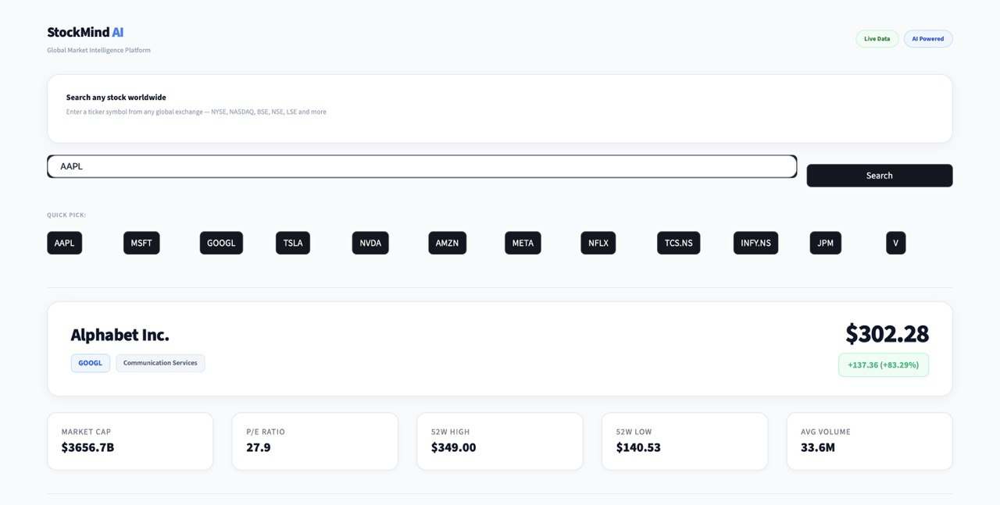
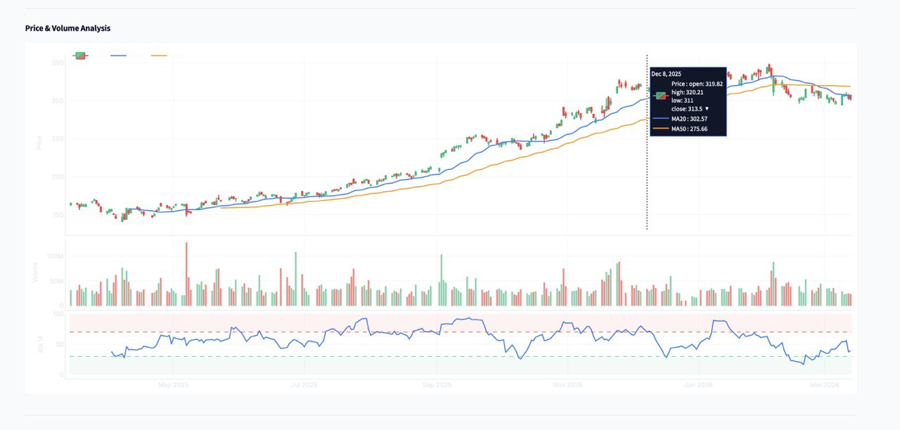
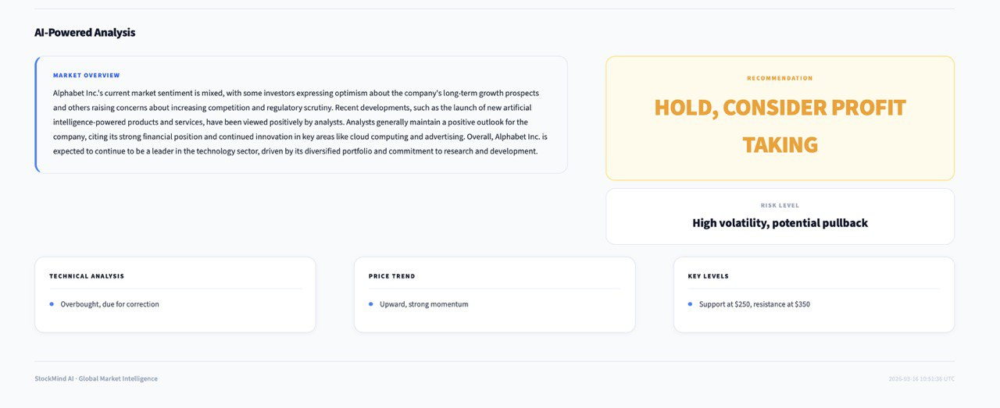

# StockMind AI — Global Market Intelligence Platform

A full-stack AI-powered stock analysis platform built with Python, FastAPI, Streamlit, Yahoo Finance, and Groq AI.

---

## Features

- Real-time stock data from Yahoo Finance for any exchange worldwide
- AI-powered analysis, recommendations, and market summaries via Groq (LLaMA 3.3 70B)
- Interactive candlestick charts with volume and RSI indicators
- Moving averages (MA20, MA50, MA200) and Bollinger Bands overlays
- Search any stock globally — NYSE, NASDAQ, NSE, BSE, LSE and more
- Clean, minimal white/blue UI built with Streamlit

---

### Search & Market Overview


### Price & Volume Chart


### AI-Powered Analysis


## Tech Stack

| Layer     | Technology                        |
|-----------|-----------------------------------|
| Frontend  | Streamlit, Plotly                 |
| Backend   | FastAPI, Uvicorn                  |
| AI        | Groq API (LLaMA 3.3 70B)         |
| Data      | Yahoo Finance (yfinance)          |
| Language  | Python 3.9+                       |

---

## Project Structure
```
stock-analysis-project/
├── backend/
│   ├── main.py               # FastAPI app entry point
│   ├── config.py             # Environment config
│   ├── models.py             # Pydantic models
│   ├── routes/
│   │   └── stocks.py         # API endpoints
│   └── services/
│       ├── yahoo_finance.py  # Stock data fetching
│       ├── grok_analyzer.py  # Groq AI analysis
│       └── data_processor.py # Technical indicators
├── frontend/
│   ├── app.py                # Streamlit UI
│   ├── config.py             # Frontend config
│   └── utils.py              # API client
├── requirements.txt
└── .env                      # Not committed
```

---

## Getting Started

### Prerequisites
- Python 3.9+
- Groq API key from [console.groq.com](https://console.groq.com)

### Installation

**1. Clone the repository**
```bash
git clone https://github.com/fuleabhijit/stock-analysis-project.git
cd stock-analysis-project
```

**2. Create virtual environment**
```bash
python3 -m venv venv
source venv/bin/activate  # macOS/Linux
venv\Scripts\activate     # Windows
```

**3. Install dependencies**
```bash
pip install -r requirements.txt
```

**4. Create `.env` file in the root**
```
GROQ_API_KEY=your_groq_api_key_here
API_BASE_URL=http://localhost:8000
```

---

## Running the App

**Terminal 1 — Start Backend**
```bash
cd backend
python3 main.py
# Running at http://localhost:8000
```

**Terminal 2 — Start Frontend**
```bash
cd frontend
streamlit run app.py
# Running at http://localhost:8501
```

Then open `http://localhost:8501` in your browser.

---

## API Endpoints

| Method | Endpoint                    | Description              |
|--------|-----------------------------|--------------------------|
| POST   | `/api/stocks/analyze`       | Full stock analysis      |
| GET    | `/api/stocks/price/{symbol}`| Get current price        |
| GET    | `/health`                   | Health check             |

**Example request:**
```bash
curl -X POST http://localhost:8000/api/stocks/analyze \
  -H "Content-Type: application/json" \
  -d '{"symbol": "AAPL", "period": "1y"}'
```

---

## Supported Exchanges

| Exchange | Suffix | Example        |
|----------|--------|----------------|
| NYSE / NASDAQ | None | AAPL, TSLA |
| NSE India | .NS | TCS.NS, INFY.NS |
| BSE India | .BO | RELIANCE.BO |
| London Stock Exchange | .L | BP.L |
| Toronto Stock Exchange | .TO | SHOP.TO |

---

## Environment Variables

| Variable       | Description              | Required |
|----------------|--------------------------|----------|
| `GROQ_API_KEY` | Your Groq API key        | Yes      |
| `API_BASE_URL` | Backend URL              | Yes      |

---

## License

MIT License — feel free to use and modify.

---

Built by [Abhijit Fule](https://github.com/fuleabhijit)